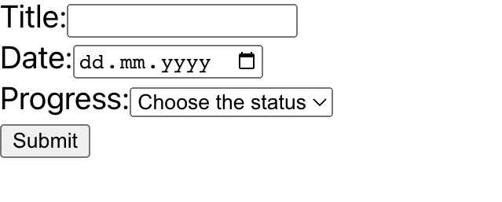
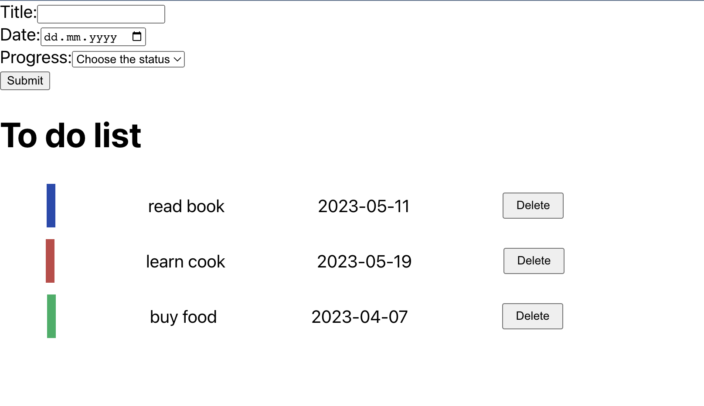
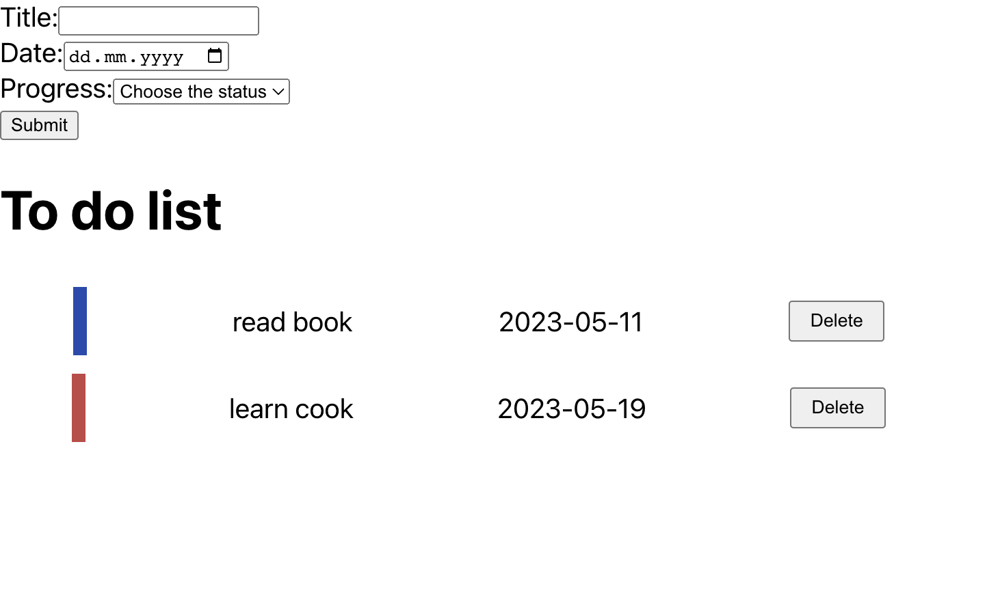

# React Assignment

### How to run the project

1. Step 1: yarn
2. Step 2: yarn start

### Requirements

1. Create a form that user can enter to-do title, date and choose status

   

2. When user click `Submit` it should show the to do item. The color of to-do item must match the to-do status:

   - in-progress: blue
   - done : green
   - not-started: red

   

3. Each to-do item have a `delete button` to remove the to-sdo item from the list

   

4. The title should be unique
